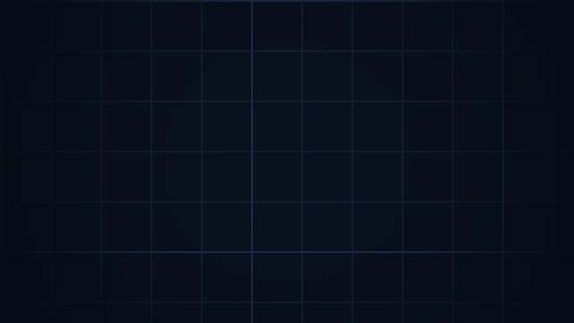
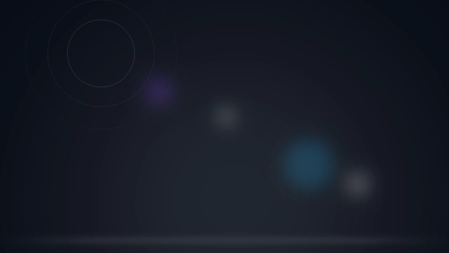
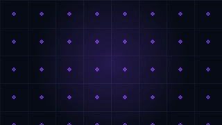
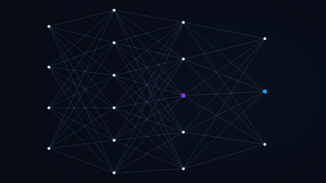

<div align="center">

# 🎨 BGKit

### Curated, Production-Ready React & Tailwind CSS Background Components

[](https://nextjs.org/)
[](https://react.dev/)
[](https://tailwindcss.com/)
[](https://www.typescriptlang.org/)
[](https://opensource.org/licenses/MIT)

**Copy-paste beautiful, interactive, and hardware-accelerated website backgrounds.**  
Pure React TypeScript components styled with modern Tailwind CSS. Zero heavyweight canvas libraries, zero runtime dependency overhead.

[**Explore Live Demo & Component Gallery →**](https://bgkit.vercel.app)

</div>

---

## 📸 Featured Backgrounds

Here is a preview of 6 featured background components from the library:

<table>
  <tr>
    <td align="center" width="33%">
      <a href="https://bgkit.vercel.app/backgrounds/vignette/vignette-grid">
        
        <br />
        <b>🎯 Vignette Grid</b>
      </a>
    </td>
    <td align="center" width="33%">
      <a href="https://bgkit.vercel.app/backgrounds/optics/lens-flare">
        
        <br />
        <b>💎 Lens Flare</b>
      </a>
    </td>
    <td align="center" width="33%">
      <a href="https://bgkit.vercel.app/backgrounds/glass/frosted-overlay">
        
        <br />
        <b>🪟 Frosted Overlay</b>
      </a>
    </td>
  </tr>
  <tr>
    <td align="center" width="33%">
      <a href="https://bgkit.vercel.app/backgrounds/grid/glow-grid">
        
        <br />
        <b>📐 Glow Grid</b>
      </a>
    </td>
    <td align="center" width="33%">
      <a href="https://bgkit.vercel.app/backgrounds/gradients/mesh-gradient">
        
        <br />
        <b>🌈 Mesh Gradient</b>
      </a>
    </td>
    <td align="center" width="33%">
      <a href="https://bgkit.vercel.app/backgrounds/network/neural-network">
        
        <br />
        <b>🧠 Neural Network</b>
      </a>
    </td>
  </tr>
</table>

<p align="center">
  <i>👉 <a href="https://bgkit.vercel.app/backgrounds">Click here to browse all 80+ background components</a> with interactive live previews.</i>
</p>

---

## ⚡ Why BGKit?

Modern landing pages and SaaS applications require captivating, high-contrast visual backdrops to convert visitors into users. **BGKit** provides an extensive, open-source library of ready-to-use background components engineered for:

- **📋 Copy & Paste Simplicity**: No bulky NPM package installations required. Just grab the self-contained `.tsx` component code and drop it into your project.
- **🚀 Ultra-High Performance**: Built with pure hardware-accelerated CSS, GPU-rendered gradients, and lightweight SVGs. Runs at butter-smooth 60fps with zero layout shift.
- **🎨 Live Global Color Customization**: Adjust your primary, secondary, and accent color palette live and watch every background update in real time.
- **📱 Fully Responsive**: Scales flawlessly across mobile phones, tablets, high-DPI Retina screens, and ultra-wide desktop monitors.
- **🌗 Dark & Light Mode Ready**: Engineered with CSS variable tokens that automatically adapt to your theme settings.
- **🔍 SEO & Web Vitals Optimized**: Zero JavaScript main-thread blocking, minimal DOM footprint, and SEO-friendly semantic markup.

---

## 📂 Category Directory (14 Collections)

| Category | Description | Live Gallery |
| :--- | :--- | :--- |
| **🌈 Gradients** | Linear, radial, mesh, and dynamic aurora gradient transitions. | [`/backgrounds/gradients`](https://bgkit.vercel.app/backgrounds/gradients) |
| **📐 Grid** | 3D perspective grids, square lattices, hexagon meshes, and cyber blueprints. | [`/backgrounds/grid`](https://bgkit.vercel.app/backgrounds/grid) |
| **⚡ Technology** | Circuit boards, technical traces, and glowing hardware interfaces. | [`/backgrounds/technology`](https://bgkit.vercel.app/backgrounds/technology) |
| **🧠 Network** | Neural network graphs, particle meshes, and constellation nodes. | [`/backgrounds/network`](https://bgkit.vercel.app/backgrounds/network) |
| **💎 Optics** | Prism refractions, caustics, and cinematic anamorphic lens flares. | [`/backgrounds/optics`](https://bgkit.vercel.app/backgrounds/optics) |
| **🪟 Glass** | Glassmorphism, frosted overlays, and crystal refraction layers. | [`/backgrounds/glass`](https://bgkit.vercel.app/backgrounds/glass) |
| **💡 Lighting** | Volumetric spotlight beams, ambient bokeh, and luminous stage lights. | [`/backgrounds/lighting`](https://bgkit.vercel.app/backgrounds/lighting) |
| **🎨 Abstract** | Organic fluid meshes, morphing blobs, and generative vectors. | [`/backgrounds/abstract`](https://bgkit.vercel.app/backgrounds/abstract) |
| **🎯 Vignette** | Soft edge-fading radials that naturally draw attention to hero headlines. | [`/backgrounds/vignette`](https://bgkit.vercel.app/backgrounds/vignette) |
| **🗺️ Pattern** | Topographic contours, isometric cubes, and micro-dot arrays. | [`/backgrounds/pattern`](https://bgkit.vercel.app/backgrounds/pattern) |
| **🌊 Waves** | Layered sine curves, contour visualizers, and flowing ribbons. | [`/backgrounds/waves`](https://bgkit.vercel.app/backgrounds/waves) |
| **📄 Texture** | Tactile film grain, paper stippling, and fine SVG noise filters. | [`/backgrounds/texture`](https://bgkit.vercel.app/backgrounds/texture) |
| **🔷 Geometry** | Origami folds, isometric tiles, and polygon tessellations. | [`/backgrounds/geometry`](https://bgkit.vercel.app/backgrounds/geometry) |
| **✨ Space** | Starfields, cosmic nebulae, and interstellar horizon particles. | [`/backgrounds/space`](https://bgkit.vercel.app/backgrounds/space) |

---

## 🚀 Quick Start & Integration Guide

### Step 1: Copy Component Code
Browse [bgkit.vercel.app](https://bgkit.vercel.app), select any background component, and click **Copy Code**. Save it inside your project's components directory:

```bash
# Example path
components/ui/MeshGradient.tsx
```

### Step 2: Configure CSS Variables
Add the theme variable definitions into your root stylesheet (`globals.css` or `index.css`):

```css
:root {
  /* BGKit Dynamic Theme Variables */
  --bg-canvas: #060b15;
  --bg-accent: #7c3aed;
  --bg-secondary: #0ea5e9;
  --bg-accent-2: #f43f5e;
  --bg-accent-3: #10b981;
  --bg-foreground: #dde4ef;
  --bg-border: #2a4468;
  --bg-line: #7dd3fc;
}

@theme {
  --color-bg-canvas: var(--bg-canvas);
  --color-bg-accent: var(--bg-accent);
  --color-bg-secondary: var(--bg-secondary);
  --color-bg-accent-2: var(--bg-accent-2);
  --color-bg-accent-3: var(--bg-accent-3);
  --color-bg-foreground: var(--bg-foreground);
  --color-bg-border: var(--bg-border);
  --color-bg-line: var(--bg-line);
}
```

### Step 3: Use in Your Project

#### Option A: Sitewide Full-Page Background (`app/layout.tsx`)
```tsx
import MeshGradient from "@/components/ui/MeshGradient";

export default function RootLayout({ children }: { children: React.ReactNode }) {
  return (
    <html lang="en">
      <body className="relative min-h-screen bg-bg-canvas text-fg">
        {/* Fixed background layer behind all routes */}
        <div className="fixed inset-0 -z-10 pointer-events-none">
          <MeshGradient />
        </div>

        {/* Foreground Page Content */}
        <main className="relative z-10">{children}</main>
      </body>
    </html>
  );
}
```

#### Option B: Scoped Hero Section (`components/HeroSection.tsx`)
```tsx
import MeshGradient from "@/components/ui/MeshGradient";

export default function HeroSection() {
  return (
    <section className="relative min-h-[600px] flex items-center justify-center overflow-hidden">
      {/* Background layer strictly scoped to hero */}
      <MeshGradient />

      {/* Hero Content */}
      <div className="relative z-10 max-w-4xl text-center px-6">
        <h1 className="text-4xl sm:text-6xl font-extrabold tracking-tight">
          Build faster with BGKit
        </h1>
        <p className="mt-4 text-lg text-slate-300">
          Copy-paste React & Tailwind CSS backgrounds for modern websites.
        </p>
      </div>
    </section>
  );
}
```

---

## 🛠️ Tech Stack & Framework Compatibility

| Layer | Technology |
| :--- | :--- |
| **Framework** | [Next.js 16 (App Router)](https://nextjs.org/) |
| **UI Library** | [React 19](https://react.dev/) |
| **Styling** | [Tailwind CSS v4](https://tailwindcss.com/) / CSS Variables |
| **Language** | [TypeScript 5](https://www.typescriptlang.org/) |
| **Icons** | [Lucide React](https://lucide.dev/) |
| **Deployment** | [Vercel](https://vercel.com/) |

> **Universal Compatibility**: BGKit components work seamlessly with **Next.js (App & Pages router)**, **Vite**, **Remix**, **Astro**, and **Gatsby**.

---

## 💻 Local Development Setup

To run BGKit locally on your machine:

```bash
# 1. Clone the repository
git clone https://github.com/iankitkd/bgkit.git
cd bgkit

# 2. Install dependencies
npm install

# 3. Start the development server
npm run dev

# 4. Open http://localhost:3000 in your browser
```

### Available Scripts

- `npm run dev` – Starts the Next.js development server.
- `npm run build` – Builds the production bundle and statically pre-renders all 186+ pages.
- `npm run start` – Runs the built production server locally.
- `npm run lint` – Runs ESLint across the codebase.
- `npm run thumbnails` – Automatically generates thumbnails using Playwright and Sharp.

---

## 📄 License

Distributed under the **MIT License**. Free to use in personal, educational, and commercial web applications. See [`LICENSE`](./LICENSE) for more information.

---
<!-- 
<div align="center">
  Crafted with ❤️ by <a href="https://github.com/iankitkd">Ankit Kumar</a>.
</div> -->
